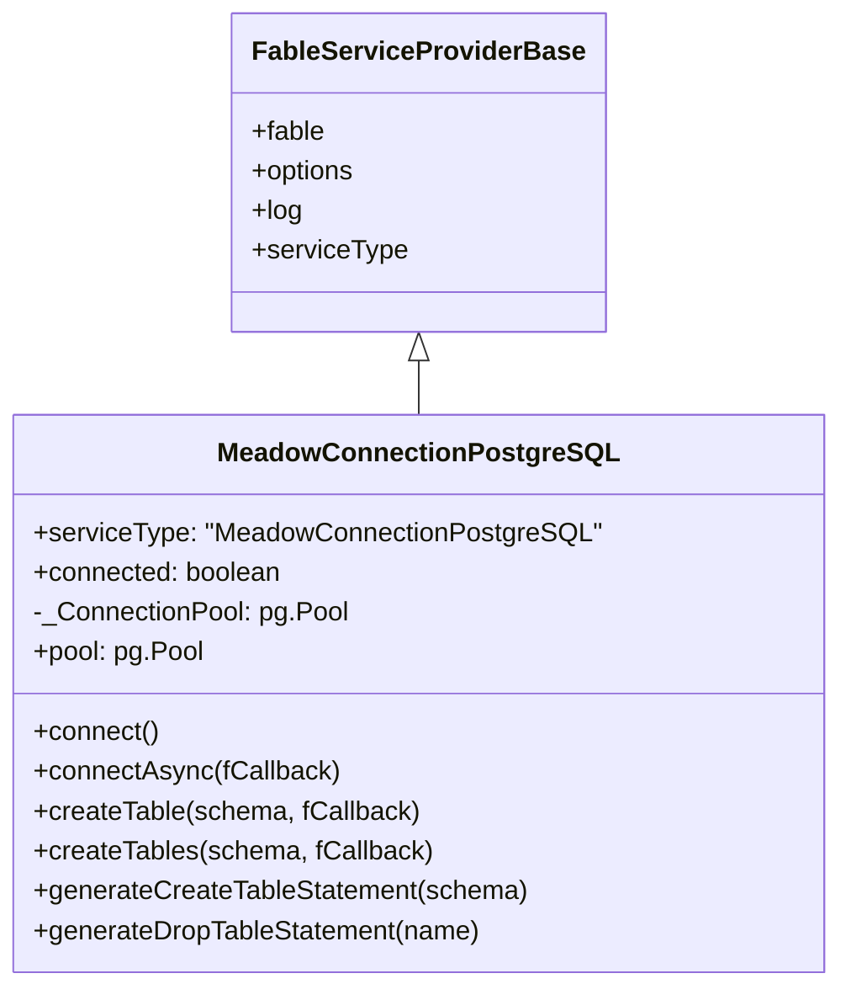

# Architecture

## System Overview

The PostgreSQL connector bridges Meadow's data access abstraction with the `pg` (node-postgres) driver. It follows the Fable service provider pattern, providing connection pool management and SQL DDL generation.

<!-- bespoke diagram: edit diagrams/system-overview.mmd or .hints.json, then: npx pict-renderer-graph build modules/meadow/meadow-connection-postgresql/docs -->

## Connection Lifecycle

<!-- bespoke diagram: edit diagrams/connection-lifecycle.mmd or .hints.json, then: npx pict-renderer-graph build modules/meadow/meadow-connection-postgresql/docs -->

## Service Provider Model

`MeadowConnectionPostgreSQL` extends `fable-serviceproviderbase`, providing standard lifecycle integration with the Fable ecosystem.

## Settings Flow

The connector normalizes Meadow-style property names to the native `pg` driver format:

<!-- bespoke diagram: edit diagrams/settings-flow.mmd or .hints.json, then: npx pict-renderer-graph build modules/meadow/meadow-connection-postgresql/docs -->

## DDL Generation Pipeline

<!-- bespoke diagram: edit diagrams/ddl-generation-pipeline.mmd or .hints.json, then: npx pict-renderer-graph build modules/meadow/meadow-connection-postgresql/docs -->

## Connection Safety

The connector includes several safety mechanisms:

<!-- bespoke diagram: edit diagrams/connection-safety.mmd or .hints.json, then: npx pict-renderer-graph build modules/meadow/meadow-connection-postgresql/docs -->

Key safety features:

| Feature | Implementation |
|---------|---------------|
| Double-connect guard | Logs error and returns if `_ConnectionPool` already exists |
| Password masking | Cleansed settings logged on double-connect attempt |
| Missing callback guard | `connectAsync()` provides a no-op callback if none given |
| Idempotent tables | `CREATE TABLE IF NOT EXISTS` + error code 42P07 handling |
| Quoted identifiers | Double-quoted table and column names in DDL |

## Connector Comparison

| Feature | PostgreSQL | MySQL | MSSQL | SQLite |
|---------|-----------|-------|-------|--------|
| Driver | `pg` | `mysql2` | `mssql` | `better-sqlite3` |
| Connection | `pg.Pool` | MySQL Pool | MSSQL Pool | File path |
| Schema | SQL DDL | SQL DDL | SQL DDL | SQL DDL |
| `pool` returns | `pg.Pool` | MySQL Pool | MSSQL Pool | SQLite Database |
| Auto-increment | `SERIAL` | `AUTO_INCREMENT` | `IDENTITY` | `INTEGER PRIMARY KEY` |
| Parameterized | `$1, $2, $3` | `?, ?, ?` | `@p1, @p2, @p3` | `?, ?, ?` |
| Boolean type | `BOOLEAN` | `TINYINT(1)` | `BIT` | `INTEGER` |
| Idempotent DDL | `IF NOT EXISTS` + 42P07 | `IF NOT EXISTS` | `IF NOT EXISTS` | `IF NOT EXISTS` |
| Identifiers | Double-quoted `"col"` | Backtick-quoted `` `col` `` | Bracket-quoted `[col]` | Double-quoted `"col"` |
